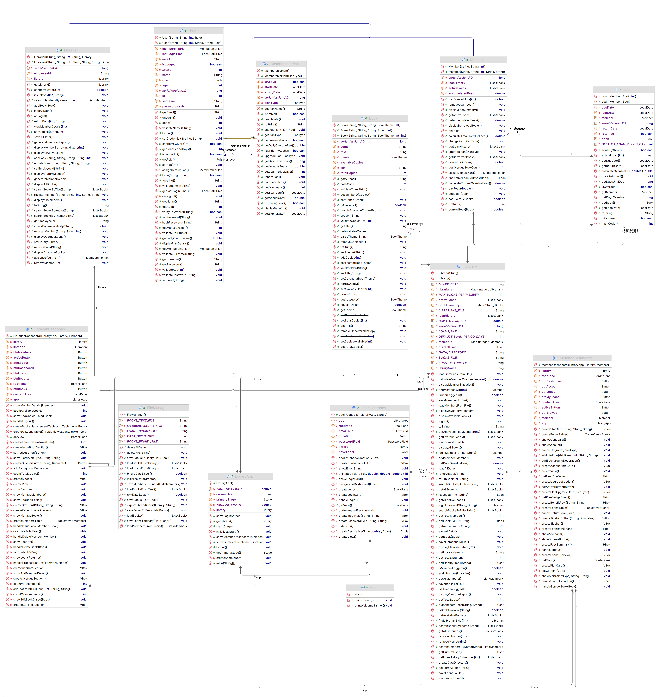

# Library Management System (LMS) — Sprint 3 Documentation

**Nigel Xherimeja, Fatbardh Troci**  
University Metropolitan Tirana  
BSc Computer Engineering

---

## Project Goal

This project is a complete Library Management System (LMS) developed in Java with a JavaFX graphical user interface. The application manages a library's core operations including book inventory, member management, loan tracking, and reporting. Sprint 3 transforms the console-based application from Sprint 1-2 into a fully functional GUI application that demonstrates the complete core workflow through an intuitive user interface.

The system emphasizes maintainability through a clear separation of concerns (UI, Logic, and Data layers) while preserving the object-oriented design, exception handling, and persistence mechanisms established in earlier sprints.

---

## Key Expected Functionalities

The system provides the following main functionalities through the GUI:

- **User Authentication**
  - Secure login screen for all users (Members and Librarians)
  - SHA-256 password hashing for security
  - Role-based dashboard routing after successful login

- **Book Management**
  - Store book information such as ISBN, title, author, and theme
  - Track total copies and available copies
  - Add, edit, and remove books from inventory (Librarian)
  - Search and filter books by title, author, or theme

- **Member Management**
  - Register new members with membership plan selection
  - View member details and borrowing history
  - Support for tiered membership plans (Basic, Premium, VIP)
  - Member account management and plan upgrades

- **Borrowing and Returning**
  - Browse available books and borrow with one click (Member)
  - Issue books to members through search interface (Librarian)
  - Process returns and calculate overdue fees
  - Real-time availability updates

- **Loan Tracking**
  - View active loans with due dates and status
  - Detect and display overdue loans with fee calculations
  - Loan history tracking for reporting

- **Membership Plans (Polymorphism)**
  - Three-tier system: Basic, Premium, VIP
  - Different borrowing limits and fee structures per plan
  - Dynamic fee calculation based on membership type

- **Data Persistence**
  - Binary file storage for all entities
  - Automatic data loading at startup
  - Data saved on logout and key actions

- **Reports & Analytics**
  - Dashboard statistics (books, members, loans)
  - Export library reports to text files
  - Overdue loans tracking

---

## Sprint 3 Implementation: JavaFX GUI

### GUI Architecture

The application follows a clean separation between UI components and business logic:

```
┌─────────────────────────────────────────────────────────────┐
│                      UI Layer (JavaFX)                       │
│  ┌─────────────┐  ┌─────────────────┐  ┌─────────────────┐  │
│  │ LibraryApp  │  │ LoginController │  │ MemberDashboard │  │
│  │  (Main)     │  │                 │  │                 │  │
│  └─────────────┘  └─────────────────┘  └─────────────────┘  │
│                                        ┌─────────────────┐  │
│                                        │LibrarianDashboard│ │
│                                        └─────────────────┘  │
└─────────────────────────────────────────────────────────────┘
                              │
                              ▼
┌─────────────────────────────────────────────────────────────┐
│                      Logic Layer                             │
│  ┌─────────────┐  ┌─────────────┐  ┌─────────────────────┐  │
│  │   Library   │  │    User     │  │  MembershipPlan     │  │
│  │  (Service)  │  │ (Abstract)  │  │   (Polymorphism)    │  │
│  └─────────────┘  └─────────────┘  └─────────────────────┘  │
│  ┌─────────────┐  ┌─────────────┐  ┌─────────────────────┐  │
│  │    Book     │  │   Member    │  │     Librarian       │  │
│  └─────────────┘  └─────────────┘  └─────────────────────┘  │
│  ┌─────────────┐                                             │
│  │    Loan     │                                             │
│  └─────────────┘                                             │
└─────────────────────────────────────────────────────────────┘
                              │
                              ▼
┌─────────────────────────────────────────────────────────────┐
│                      Data Layer                              │
│  ┌─────────────────────────────────────────────────────┐    │
│  │                   FileManager                        │    │
│  │  • saveBooksToText()      • loadBooksFromText()      │    │
│  │  • saveBooksToBinary()    • loadBooksFromBinary()    │    │
│  │  • saveMembersToBinary()  • loadMembersFromBinary()  │    │
│  │  • saveLoansToBinary()    • loadLoansFromBinary()    │    │
│  │  • exportLibraryReport()                             │    │
│  └─────────────────────────────────────────────────────┘    │
│                         │                                    │
│                         ▼                                    │
│  ┌─────────────────────────────────────────────────────┐    │
│  │            Binary Files (data/*.dat)                 │    │
│  │  books.dat | members.dat | librarians.dat | loans.dat│   │
│  └─────────────────────────────────────────────────────┘    │
└─────────────────────────────────────────────────────────────┘
```

---

### Screen Descriptions

#### 1. Login Screen (`LoginController.java`)

The entry point for all users featuring:

- Clean, centered login card with shadow effects
- Email and password input fields with validation
- Animated decorative background elements
- Error feedback with shake animation on failed login
- Automatic role detection and dashboard routing

**Authentication Flow:**

1. User enters email and password
2. System authenticates against stored credentials (SHA-256 hashed)
3. On success: Route to appropriate dashboard (Member or Librarian)
4. On failure: Display error message with visual feedback

---

#### 2. Member Dashboard (`MemberDashboard.java`)

A comprehensive dashboard for library members with sidebar navigation:

**Dashboard Section:**

- Welcome message with member name
- Statistics cards: Books Borrowed, Days Until Due, Outstanding Fees, Loan Limit
- Quick action buttons for common tasks

**Browse Books Section:**

- Search bar with real-time filtering
- Theme filter dropdown (Fiction, Science, History, etc.)
- Table view of available books with details
- One-click borrow functionality with confirmation dialog

**My Loans Section:**

- Table of active loans with book details, loan date, due date, status
- Status badges (Active, Overdue, Due Soon)
- Return book functionality with fee calculation

**My Account Section:**

- Personal information display
- Current membership plan details
- Plan upgrade options with pricing
- Fee summary and payment tracking

---

#### 3. Librarian Dashboard (`LibrarianDashboard.java`)

An administrative dashboard with full system control:

**Dashboard Section:**

- Overview statistics: Total Books, Total Members, Active Loans, Overdue Count
- System health indicators
- Quick access to key functions

**Manage Books Section:**

- Complete book inventory table
- Add new books with all details
- Edit existing book information
- Remove books (with active loan validation)
- Search and filter capabilities

**Manage Members Section:**

- Member directory with plan information
- Register new members with plan selection
- View member details and borrowing history
- Member status management

**Loans & Returns Section:**

- Issue books to members via search
- Process returns with automatic fee calculation
- View all active loans system-wide
- Overdue loan management

**Reports Section:**

- Library statistics summary
- Books by theme breakdown
- Membership plan distribution
- Export functionality to text file

---

### Navigation Flow

```
┌──────────────┐
│ Login Screen │
└──────┬───────┘
       │
       ├─── Member Login ────► Member Dashboard
       │                         ├── Dashboard (Home)
       │                         ├── Browse Books
       │                         ├── My Loans
       │                         ├── My Account
       │                         └── Logout ──► Login Screen
       │
       └─── Librarian Login ──► Librarian Dashboard
                                  ├── Dashboard (Home)
                                  ├── Manage Books
                                  ├── Manage Members
                                  ├── Loans & Returns
                                  ├── Reports
                                  └── Logout ──► Login Screen
```

---

## UI Design System

The application uses a clean, minimal design system with:

### Design Tokens

- **Background**: Off-white (`#f5f5f7`)
- **Surface**: White (`#ffffff`) for cards and panels
- **Accent**: Indigo (`#4f46e5`) for primary actions
- **Text**: Near-black (`#1a1a1a`) primary, gray (`#6b7280`) secondary

### Component Specifications

- **Cards**: 14px border radius, subtle shadow
- **Buttons**: 40px height, 12px radius
- **Inputs**: 40px height, 10px radius, accent focus ring
- **Tables**: White rows, 44px row height, hover highlighting
- **Sidebar**: 240px width, accent indicator for active item
- **Badges**: Pill-shaped with status colors (success/warning/danger)

---

## Collections Usage

The system demonstrates meaningful use of Java collections:

### HashMap Usage

```java
// Library.java - Fast lookup by ID/ISBN
private Map<String, Book> bookInventory;     // ISBN → Book
private Map<Integer, Member> members;         // MemberID → Member
private Map<Integer, Librarian> librarians;   // LibrarianID → Librarian
```

### List Usage

```java
// Ordered collections for loans and history
private List<Loan> activeLoans;
private List<Loan> loanHistory;

// Member's active loans
private List<Loan> borrowedBooks;  // In Member.java
```

### ObservableList (JavaFX)

```java
// Real-time UI updates in dashboard tables
ObservableList<Book> bookData = FXCollections.observableArrayList(library.getAllBooks());
booksTable.setItems(bookData);
```

---

## Entity Overview and Relationships

### Class Hierarchy

```
                    ┌──────────────┐
                    │  Serializable │
                    └──────┬───────┘
                           │
       ┌───────────────────┼───────────────────┐
       │                   │                   │
┌──────┴──────┐     ┌──────┴──────┐     ┌──────┴──────┐
│    Book     │     │    User     │     │    Loan     │
│             │     │ (Abstract)  │     │             │
└─────────────┘     └──────┬──────┘     └─────────────┘
                           │
              ┌────────────┴────────────┐
              │                         │
       ┌──────┴──────┐           ┌──────┴──────┐
       │   Member    │           │  Librarian  │
       │             │           │             │
       └──────┬──────┘           └─────────────┘
              │
              │ has-a
              ▼
       ┌─────────────┐
       │MembershipPlan│
       │ (Abstract)   │
       └──────┬──────┘
              │
    ┌─────────┼─────────┐
    │         │         │
┌───┴───┐ ┌───┴───┐ ┌───┴───┐
│ Basic │ │Premium│ │  VIP  │
│ Plan  │ │ Plan  │ │ Plan  │
└───────┘ └───────┘ └───────┘
```

### Book

The `Book` class represents a book in the library inventory with:

- ISBN, Title, Author, Theme
- Total copies and available copies management
- Serializable for persistence

### User (Abstract Class)

Base class for all system users with:

- Personal information (name, age, email)
- Authentication (email, password hash)
- Login/logout state tracking

### Member

Extends `User` with:

- Active loans list
- Membership plan (polymorphic)
- Borrowing and returning capabilities
- Fee tracking

### Librarian

Extends `User` with:

- Employee ID
- Reference to Library for management operations
- Administrative privileges

### Loan

Links Member with Book containing:

- Loan date and due date
- Return status
- Overdue fee calculation

### MembershipPlan (Abstract - Polymorphism)

Demonstrates polymorphism with three implementations:

- **BasicPlan**: 3 books, 14 days, $0.50/day fee
- **PremiumPlan**: 5 books, 21 days, $0.30/day fee
- **VIPPlan**: 10 books, 30 days, $0.10/day fee

---

## Object-Oriented Design Principles

### Inheritance

- `User` → `Member`, `Librarian`
- `MembershipPlan` → `BasicPlan`, `PremiumPlan`, `VIPPlan`

### Encapsulation

- Private fields with public getters/setters
- Validation in constructors and setters
- Internal state protected from invalid modifications

### Polymorphism

- `MembershipPlan.calculateOverdueFee(double days)` - Different implementations per plan
- `MembershipPlan.getMaxLoans()` - Returns plan-specific limit
- Method overriding in `toString()` across hierarchy

### Abstraction

- Abstract `User` class defines common interface
- Abstract `MembershipPlan` defines fee calculation contract

---

## Exception Handling

### Validation Exceptions

- `IllegalArgumentException` for invalid data (empty names, invalid emails, negative values)

### File Handling

- `IOException` caught during file operations
- `ClassNotFoundException` handled for deserialization
- Graceful fallback when data files don't exist

### Authentication

- Null checks for missing credentials
- Secure password comparison

---

## File Input/Output and Persistence

Sprint 3 extends persistence to all entities:

| Entity         | File                    | Format                 |
| -------------- | ----------------------- | ---------------------- |
| Books          | `data/books.dat`        | Binary (Serialization) |
| Members        | `data/members.dat`      | Binary (Serialization) |
| Librarians     | `data/librarians.dat`   | Binary (Serialization) |
| Active Loans   | `data/loans.dat`        | Binary (Serialization) |
| Loan History   | `data/loan_history.dat` | Binary (Serialization) |
| Books (backup) | `books.txt`             | Text (CSV-style)       |

**Persistence Flow:**

1. Data loaded automatically at application startup
2. Sample data created if no existing data found
3. Data saved on logout, book operations, and loan processing
4. Reports exported to text files on demand

---

## Program Flow

1. **Startup**: Application launches, loads all data from binary files
2. **Login**: User authenticates via login screen
3. **Dashboard**: Role-appropriate dashboard displayed
4. **Operations**: User performs actions (borrow, return, manage)
5. **Persistence**: Changes saved to data files
6. **Logout**: Session ends, data saved, return to login

---

## Sprint 3 Requirements Compliance

| Requirement                | Status | Implementation                                           |
| -------------------------- | ------ | -------------------------------------------------------- |
| JavaFX GUI with 2+ screens | ✅     | Login, Member Dashboard, Librarian Dashboard             |
| Working navigation         | ✅     | Role-based routing, sidebar navigation                   |
| Separation of concerns     | ✅     | UI/Logic/Data layers clearly separated                   |
| List usage                 | ✅     | Active loans, loan history, book lists                   |
| HashMap usage              | ✅     | Book inventory, member registry, librarian registry      |
| Complete use case          | ✅     | Full workflow: login → browse → borrow → return → logout |
| Data persistence           | ✅     | Binary files for all entities                            |

---

## Class Diagram



---

## How to Run

### Prerequisites

- Java 17 or higher
- Maven 3.6+

### Running the Application

```bash
# From project root directory
mvn javafx:run
```

### Default Credentials

| Role      | Email                  | Password    |
| --------- | ---------------------- | ----------- |
| Librarian | fatbardh@librarian.com | admin123    |
| Member    | alice@email.com        | password123 |
| Member    | bob@email.com          | password123 |
| Member    | charlie@email.com      | password123 |

---

## New Files Added in Sprint 3

| File                      | Description                         | Lines |
| ------------------------- | ----------------------------------- | ----- |
| `LibraryApp.java`         | Main JavaFX Application entry point | ~170  |
| `LoginController.java`    | Login screen with authentication    | ~380  |
| `MemberDashboard.java`    | Complete member dashboard           | ~860  |
| `LibrarianDashboard.java` | Complete librarian dashboard        | ~1290 |
| `styles.css`              | Clean UI design system              | ~650  |

---

## Conclusion

Sprint 3 completes the Library Management System by delivering a fully functional JavaFX GUI application. The system demonstrates:

- **Complete workflow** from authentication through all library operations
- **Clean architecture** with separated UI, logic, and data layers
- **Robust OOP design** with inheritance, polymorphism, and encapsulation
- **Persistent storage** for all application data
- **Professional UI** with modern, minimal design system

The application is production-ready, maintainable, and extensible for future enhancements.
