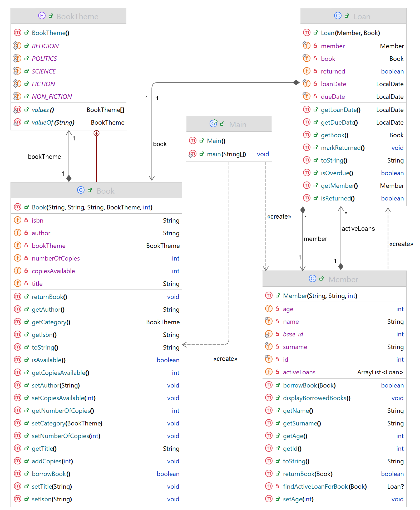

# Library Management System - Sprint 1
```
          ┓ ┏  ┓                                 
          ┃┃┃┏┓┃┏┏┓┏┳┓┏┓  ╋┏┓  ┓┏┏┓┓┏┏┓          
          ┗┻┛┗ ┗┗┗┛┛┗┗┗   ┗┗┛  ┗┫┗┛┗┻┛           
┓ •┓           ┳┳┓              ┛     ┏┓         
┃ ┓┣┓┏┓┏┓┏┓┓┏  ┃┃┃┏┓┏┓┏┓┏┓┏┓┏┳┓┏┓┏┓╋  ┗┓┓┏┏╋┏┓┏┳┓
┗┛┗┗┛┛ ┗┻┛ ┗┫  ┛ ┗┗┻┛┗┗┻┗┫┗ ┛┗┗┗ ┛┗┗  ┗┛┗┫┛┗┗ ┛┗┗
            ┛            ┛               ┛  
```
## Project Goal

This is a simple Library Management System (LMS) Java application designed to help a library manage its books and members. It provides a basic digital framework for tracking which books are available, which have been borrowed, and who borrowed them. The project focuses on applying Object-Oriented Programming (OOP) principles to model real-world entities and their interactions in a clear and organized way.

## Key Expected Functionalities

The system focuses on essential operations that define the workflow of a small library:

- **Book Management:** Add books with details like title, author, ISBN, and track the number of available copies.

- **Member Management:** Register new members, each with a unique ID and a record of borrowed books.

- **Borrowing Books:** Check availability, create a loan record, and decrease the available copy count.

- **Returning Books:** Update the loan record and restore the book’s availability.

- **Loan Tracking:** Display current loans and due dates for each member.


These functions are implemented through collaboration between three main classes: `Book`, `Member`, and `Loan`.

## Requirements and Entity Relationships

At the core of the system are three interconnected classes that model the relationships and data flow of the library:

- **Book:** Represents a library item with attributes such as ISBN, title, author, and number of copies. Handles borrowing and returning actions to maintain availability.

- **Member:** Represents a library user who can borrow and return books. Each member keeps track of their active loans.

- **Loan:** Connects a `Book` and a `Member`, recording when a book was borrowed, when it is due (14 days later), and whether it has been returned.


The relationships between these entities form the logical structure of the system:

- A **Member** can have many **Loans**.

- Each **Loan** is linked to one **Book**.

- **Books** update their availability based on the state of their active loans.

These interactions allow the system to manage borrowing and returning operations smoothly while keeping data consistent. The relationships serve as the base for all user actions within Sprint 1’s scope and create a clear, extendable structure for future development.

## UML Class Diagram




<p style="text-align:center;">Nigel Xherimeja, Fatbardh Troci<br> University Metropolitan Tirana<br>BSc Computer Engineering</p>