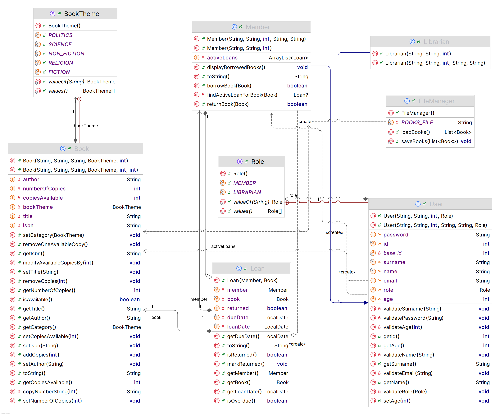

# Library Management System (LMS) — Sprint 2 Documentation

**Nigel Xherimeja, Fatbardh Troci**  
University Metropolitan Tirana  
BSc Computer Engineering  

---

## Project Goal

This project is a console-based Library Management System (LMS) developed in Java. The purpose of the application is to manage a library’s core operations, including book inventory, members, and borrowing activities. Sprint 2 extends the functionality and structure of Sprint 1 by applying object-oriented programming principles such as inheritance, encapsulation, and polymorphism, as well as introducing exception handling and file-based persistence.

---

## Key Expected Functionalities

The system provides the following main functionalities:

- **Book Management**
  - Store book information such as ISBN, title, author, and theme
  - Track total copies and available copies
  - Ensure that book availability is updated correctly during borrow and return operations

- **Member Management**
  - Represent library members as users with personal information
  - Keep track of borrowed books through active loans

- **Borrowing and Returning**
  - Allow members to borrow books only if copies are available
  - Create a loan when a book is borrowed
  - Restore book availability when a book is returned

- **Loan Tracking**
  - Store borrowing date and due date for each loan
  - Detect overdue loans
  - Mark loans as returned

- **Data Persistence**
  - Persist book data to a file
  - Load saved book data when the program starts

---

## Scope Limitation for File Operations

In Sprint 2, **file input/output operations have been implemented only for the `Book` class**. 
The same functionality can and will be also extended to the other classes, but for this sprint 
other classes such as `User`, `Member`, `Librarian`, and `Loan` are managed in memory during runtime and are not persisted to disk.

---

## Entity Overview and Relationships

The system is structured around several core classes that represent real-world library entities.

### Book

The `Book` class represents a book in the library inventory. It stores identifying information and manages copy availability.

Main attributes include:
- ISBN
- Title
- Author
- Book theme
- Total number of copies
- Available copies

The class ensures that available copies cannot exceed total copies or drop below zero.

---

### User (Abstract Class)

The `User` class is an abstract base class that defines common properties shared by all system users.  
It includes identity-related data and input validation to prevent invalid objects from being created.

Subclasses:
- `Member`
- `Librarian`

---

### Member

The `Member` class extends `User` and represents a library member.  
Each member maintains a list of active loans and can borrow or return books.

---

### Librarian

The `Librarian` class extends `User` and represents administrative users of the system.  
This subclass has not been fully implemented yet, but it has been added to illustrate how inheritance can be used in real life scenarios.

---

### Loan

The `Loan` class links a `Member` with a `Book`.  
It stores information about borrowing date, due date, and return status, and is used to determine overdue loans.

---

## Object-Oriented Design (Sprint 2)

Sprint 2 focuses on applying fundamental OOP concepts.

### Inheritance

- `User` is an abstract class
- `Member` and `Librarian` extend `User`

This hierarchy avoids code duplication and models real-world relationships.

---

### Encapsulation

- All class attributes are private or protected
- Access is controlled through constructors and getter/setter methods
- Validation logic ensures that objects remain in a valid state

---

### Polymorphism

Polymorphism is demonstrated through:
- Method overriding (e.g., `toString()` in subclasses)
- Method overloading

---

## Exception Handling

The system uses exception handling to ensure stability and correct behavior.

### Validation Exceptions
- `IllegalArgumentException` is thrown when invalid data is provided (e.g., invalid age, empty name, invalid email)

### File Handling Exceptions
- `IOException` is caught during file read/write operations
- `NumberFormatException` and `IllegalArgumentException` are handled when corrupted or invalid data is encountered while loading books

---

## File Input/Output and Persistence

File persistence is implemented **only for the `Book` class**.

- Book data is saved to a text file
- Each book is stored on a single line using a delimiter-based format
- When the program starts, the file is read and books are reconstructed in memory

This allows the library inventory to persist between program executions.

---

## Program Flow

1. Book data is loaded from file at startup
2. Users and loans are created during runtime
3. Members borrow and return books
4. Book availability is updated accordingly
5. Book data is saved back to file before program termination

---

## Sprint 2 Requirements Compliance

- Abstract class implemented (`User`)
- Inheritance used (`Member`, `Librarian`)
- Encapsulation enforced through access control and validation
- Polymorphism demonstrated through superclass references, overloaded and overridden methods
- Exception handling implemented for data validation and file operations
- File input/output implemented with persistence (Book data only)

---
## Class Diagram

---

## Conclusion

Sprint 2 enhances the Library Management System by applying core object-oriented principles and introducing persistent storage for book data. The system remains simple, modular, and extensible, providing a solid foundation for future enhancements.
